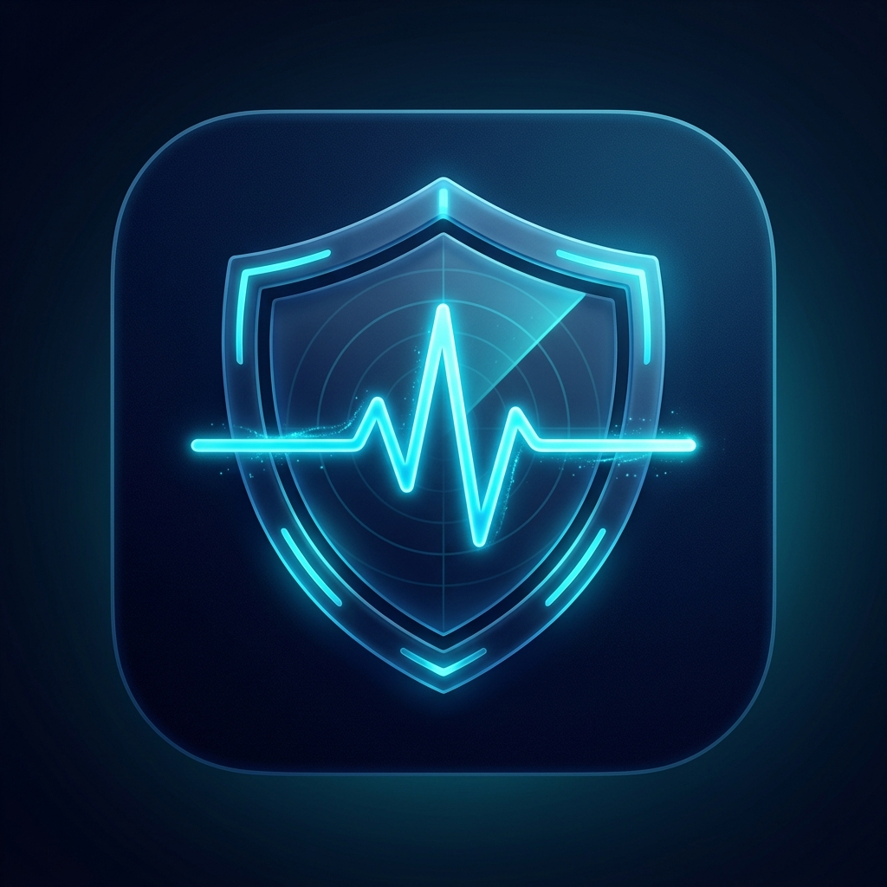
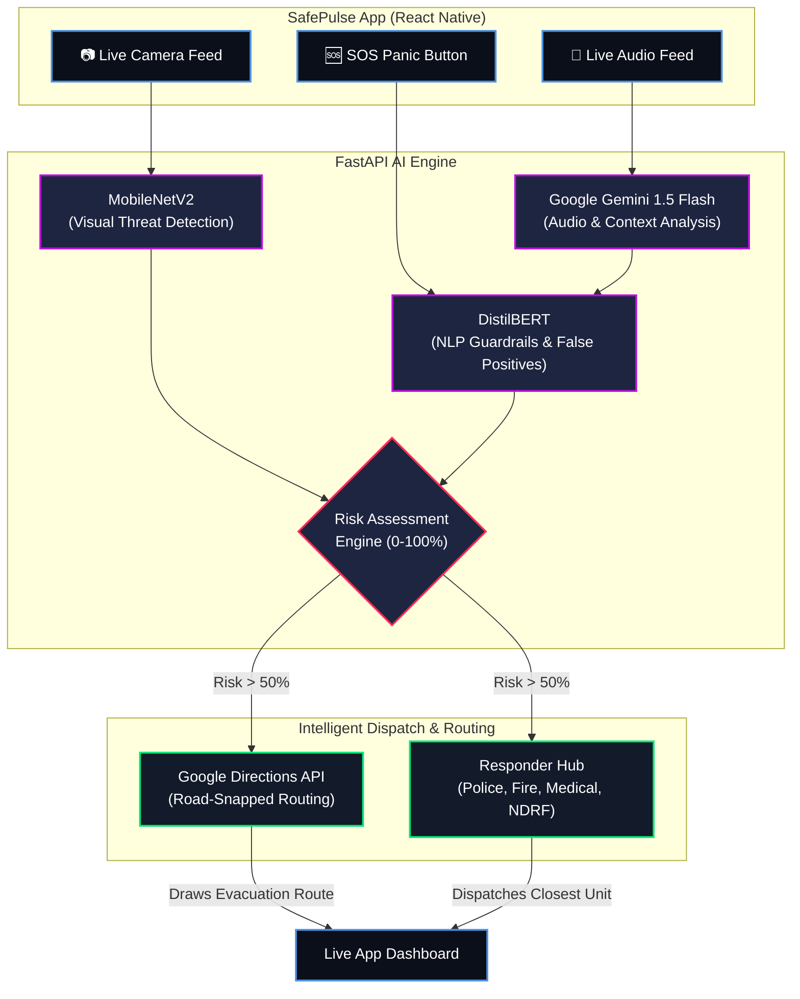

<div align="center">
  
  <h1>SafePulse AI</h1>
  <p><strong>Tri-Modal AI Emergency Response & Intelligent Evacuation System</strong></p>
  <p><i>Built for the Google Solution Challenge 2026</i></p>
</div>

<br />

## 🌟 Overview
**SafePulse AI** is a next-generation, autonomous emergency response platform. It utilizes a **Tri-Modal AI Engine** (Audio, Vision, and Context) to detect threats in real-time, instantly calculate risk scores, map danger zones, and coordinate intelligent evacuation routes while simultaneously dispatching the appropriate emergency response teams.

Built with a premium "Cyber-Glass" aesthetic, SafePulse ensures that when seconds count, data is presented with absolute clarity and zero panic.

## 🏗️ System Architecture & Flow Diagram

The following architecture demonstrates how the Tri-Modal AI engine autonomously processes environmental inputs and coordinates a live response.



## ✨ Key Features

### 🧠 Tri-Modal AI Threat Detection
- **Audio Intelligence (Google Gemini 1.5 Flash):** Listens to live audio feeds, transcribes context, and detects distress signals, panic, or specific verbal threats.
- **Vision AI (MobileNetV2):** Analyzes live camera feeds to identify visual threats like fires, weapons, or crowd stampedes locally with extreme low latency.
- **Contextual Guardrails (DistilBERT):** NLP-based intent filtering that prevents false positives (e.g., ignoring "this movie is fire" while escalating "there is a fire in the lobby").

### 🗺️ Intelligent Evacuation Mapping
- **Dynamic Threat Placement:** Pinpoints the exact location of a threat based on the reported zone.
- **Google Directions Integration:** Generates real-time, road-snapped walking routes leading *away* from the danger to designated Safe Assembly Points.
- **Auto-Framing Camera:** The map automatically zooms and pans to frame the user, the threat, and the evacuation route instantly.

### 🚨 Autonomous Dispatch & Responder Hub
- **AI Triage:** Automatically calculates a 0-100% Risk Score and assigns the correct team (e.g., Medical, Fire, Crowd Control).
- **Live SOS Hub:** Integrates real Indian Emergency Services (Police 100, Fire 101, Ambulance 102, NDRF 108, National 112) with instant 1-tap dialing.
- **Comms Log:** A live, timestamped event tracker that logs every AI decision and system status update in real-time.

---

## 🛠️ Technology Stack

**Frontend (Mobile App)**
- **Framework:** React Native / Expo
- **Mapping:** `react-native-maps` + Google Directions API
- **Styling:** Custom Vanilla CSS, Glassmorphism, `expo-linear-gradient`
- **Native Modules:** `expo-av` (Audio), `expo-image-picker` (Camera), `expo-speech` (TTS), `Linking` (Dialer)

**Backend (AI Engine)**
- **Server:** FastAPI (Python)
- **Audio Model:** Google Gemini 1.5 Flash API
- **Vision Model:** MobileNetV2 (PyTorch/Torchvision)
- **NLP Guardrails:** Hugging Face `distilbert-base-uncased-mnli`

---

## 🚀 How to Run Locally

### 1. Start the AI Backend
```bash
cd emergency_service
python -m venv venv
venv\Scripts\activate   # (Windows) or source venv/bin/activate (Mac/Linux)
pip install -r requirements.txt
python main.py
```
*The backend will start on `http://0.0.0.0:8000`*

### 2. Configure Environment
In the `SafePulse` folder, create a `.env` file:
```env
EXPO_PUBLIC_API_URL=http://<YOUR_LAPTOP_IP>:8000
```

### 3. Start the Frontend Application
```bash
cd SafePulse
npm install
npx expo start -c
```
*Scan the QR code with the Expo Go app on your physical device.*

---

## 📸 Application Gallery

*(Add screenshots here for your GitHub repo)*
- `splash_screen.png`
- `main_dashboard.png`
- `live_map_evacuation.png`
- `ai_insights.png`
- `responders_hub.png`

---

## 🌍 Impact (Google Solution Challenge)
SafePulse directly addresses the **UN Sustainable Development Goals (SDGs)**:
- **Goal 3 (Good Health and Well-being):** Drastically reducing emergency response times and ensuring rapid medical dispatch.
- **Goal 9 (Industry, Innovation, and Infrastructure):** Building resilient, AI-powered smart-city infrastructure.
- **Goal 11 (Sustainable Cities and Communities):** Making urban environments inherently safer through autonomous monitoring and panic-free evacuation systems.

---
<div align="center">
  <i>Every Second Counts. SafePulse responds before you ask.</i>
</div>
